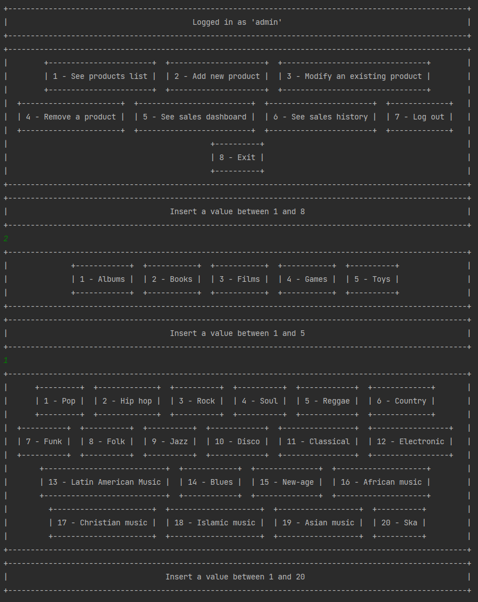
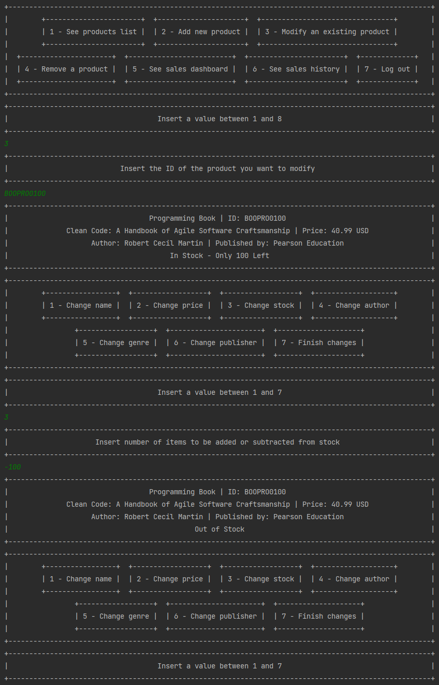
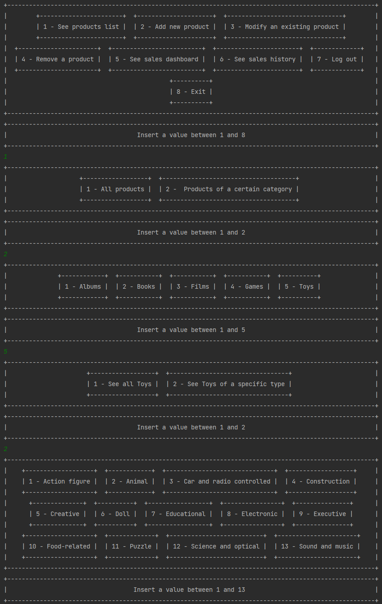
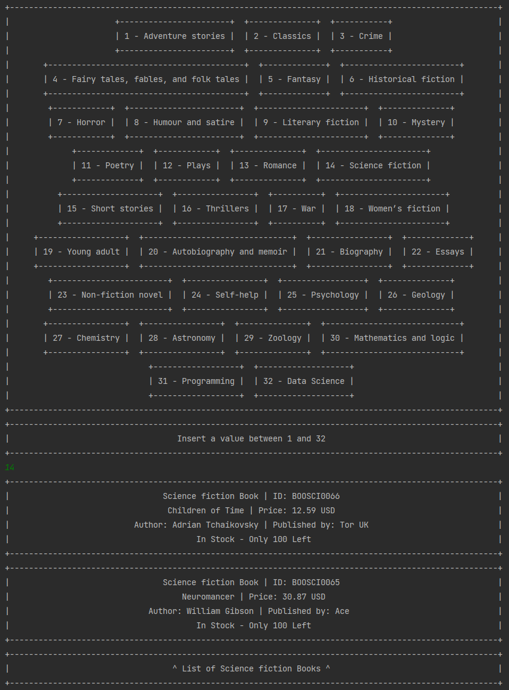

[English](README.md) | [Português](README.pt-br.md)

## Bookstore Exercise

This project is a bookstore application developed using Java as part of an
[intensive training program](https://polotech.americanas.io/) sponsored by
[Americanas](https://en.wikipedia.org/wiki/Lojas_Americanas) at [Ada Tech](https://ada.tech/sou-aluno).

### Requirements

The system must be able to register the following products:
- Books: Must have name, id, price, genre, writer, publisher.
- Games: Must have name, id, price, distributor, genre, and studio.
- Movies: Must have name, id, price, studio, director, genre, and producer.
- Music albums: Must have name, id, price, musician/band, genre, and record label.
- Toys: Must have name, id, price and type.

Additionally, the system must have a cash register which must have information about the money present in it.

The system must have the following functionalities:
- Add, view, change, and remove any product from the system.
- See how many items of a specific type exist in stock.
- View the complete list of items in stock.
- View the list of items in stock by category.
- Perform the purchase operation, when performing this operation the purchased products are removed from stock and the money paid must be added to the cash register.

## My Implementation

### Database

To store and fetch the items, I created a three-dimensional HashMap. 

The first dimension of this HashMap contains HashMaps that store all HashMaps of items from a certain category, with the category name being the key used to acess it (E.g. "Books").

Inside these HashMaps, are the HashMaps that contain items from a certain genre or type, with the genre/type being the key (E.g. "Science fiction", "Romance", etc).

Inside the final HashMap layer, all items of this category and genre a can be found, with the product's ID being the key used to access it.

This way, it is possible to quickly look up a specific item without having to iterate through all items until the product of a specific ID is found.

Also, since the location of all items is already known, there is no need to iterate through any unnecessary items when looking for all items of a specific category and/or genre or ID.

#### HashMaps creation

In this project, I opted to offer a pre-selected list of genres/types, that the user will be able to select via
a printed menu. To make modifications such as the addition of new categories and genres/types as easy as possible,
all HashMaps are created automatically,
initializing the right number of HashMaps at the right location, based on arrays containing all categories.
The menus' options and accepted input also work based on these arrays,
making adding more genres as easy as adding a string to an array. 

#### ID search 

Since there are multiple layers of HashMaps, the ID must carry information about where this item will be located.
Since the items are organized by category and then by genre/type,
the ID must carry identifiers for those to be able to quickly look into the third layer of HashMaps,
which contains the products.

To do this, I opted for the simple solution of creating an ID with the 3 first characters of the category,
followed by the 3 first characters of the genre/type, and finnaly, a numeric ID. 

This way, I only needed to create methods to "translate" these 6 character identifiers to the keys necessary to access
the HashMap where the item is located.

### Menus

User interactions are made mostly using menus, which are printed taking into account the number of options,
represented by String arrays. 

There are three initial menus, 

### Manipulating products 

Products can be added, modified and removed by logging in with the username and password `admin`.

#### Adding products

When adding products, you will be prompted to chose between the categories: `Albums`, `Books`, `Films`,`Games`
and `Toys`, followed by selecting one of the genres/types of the chosen category.

#### Modifying products

When modifying products, you will be prompted to insert the products ID, and will be prompted with the following menu:

#### Viewing product list

You can access the product list while logged in as a customer or with the `admin` account. 

Upon selecting the `1 - See product list` option, you will be prompted on what products you want to see.
You can choose to see all products, all products from a category, or products from a specific
genre/type within a category.

The resulting list will be displayed in the following way: 

## Running the Code

To run this project, clone the repository and import it into your favorite Java development environment.
Make sure to have Java Development Kit (JDK) version 17 or above installed on your machine.