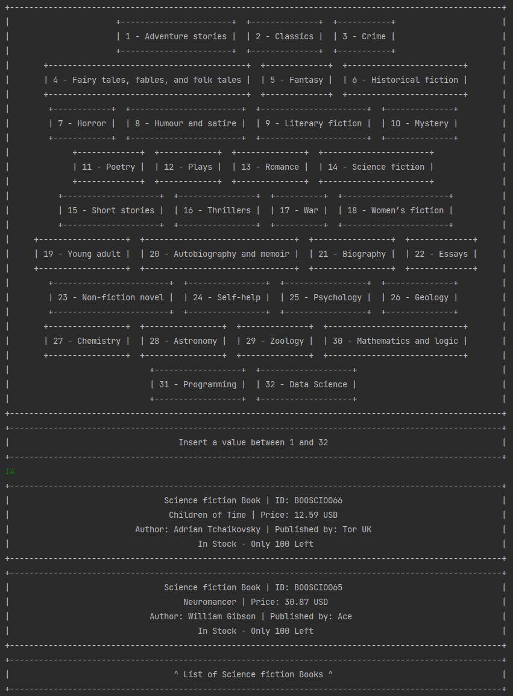

[English](README.md) | [Português](README.pt-br.md)

## Exercício Livraria

Este projeto é uma aplicação de livraria desenvolvida com Java, e foi criado como parte do segundo módulo da trilha de
Back-end do programa [Futuro Polo Tech](https://polotech.americanas.io/). Este programa é uma parceria entre a escola
git sde tecnologia [Ada](https://ada.tech/sou-aluno) e a [Americanas](https://carreiras.americanas.com/).

### Requisitos

O sistema deve ser capaz de registrar os seguintes produtos:
- Livros: Devem conter nome, id, preço, gênero, escritor, editora.
- Jogos: Devem conter  id, preço, distribuidora, gênero e estúdio.
- Filmes: Devem conter nome, id, preço, estúdio, diretor, gênero e produtor.
- Álbuns de música: Devem conter nome, id, preço, músico/banda, gênero e selo.
- Brinquedos: Devem conter nome, id, preço e tipo.

Além disso, o sistema deve possuir um caixa, que deve conter informações sobre o dinheiro presente nele.

O sistema deve ter as seguintes funcionalidades:
- Adicionar, visualizar, alterar e remover qualquer produto do sistema.
- Ver quantos itens de um tipo específico existem no estoque.
- Ver a listagem completa dos itens em estoque.
- Ver a listagem dos itens em estoque por categoria.
- Realizar a operação de compra. Ao realizar esta operação os produtos comprados são removidos do estoque e o dinheiro pago deve ser adicionado ao caixa.

## Minha Implementação

### Banco de Dados em memória

Para armazenar e recuperar os itens, criei um HashMap tridimensional.

A primeira dimensão deste HashMap contém HashMaps que armazenam todos os HashMaps de itens de uma determinada categoria,
com o nome da categoria sendo a chave usada para acessá-la (por exemplo, "Livros").

Dentro desses HashMaps, estão os HashMaps que contém itens de um determinado gênero ou tipo, com o gênero/tipo sendo a
chave (por exemplo, "Ficção científica", "Romance", etc.).

Dentro da camada final de HashMap, todos os itens dessa categoria e gênero podem ser encontrados, com o ID do produto 
sendo a chave usada para acessá-lo.

Dessa forma, é possível procurar rapidamente um item específico sem ter que iterar por todos os itens até que o produto
de um ID específico seja encontrado.

Além disso, como a localização de todos os itens já é conhecida, não é necessário iterar por quaisquer itens 
desnecessários ao procurar por todos os itens de uma categoria e/ou gênero específico ou ID.

#### Criação dos HashMaps

Neste projeto, optei por oferecer uma lista pré-selecionada de gêneros/tipos, que o usuário poderá selecionar via um menu impresso.

Para tornar modificações, como a adição de novas categorias e gêneros/tipos, o mais fácil possível, todos os HashMaps são criados automaticamente,
inicializando o número certo de HashMaps na localização certa, baseado em arrays que contém todas as categorias.

As opções de menu e o input aceito também funcionam com base nesses arrays, tornando a adição de mais gêneros tão fácil quanto adicionar uma string a um array.

#### Busca por ID

Como há múltiplas camadas de HashMaps, o ID deve carregar informações sobre onde este item estará localizado. 
Como os itens são organizados por categoria e, em seguida, por gênero/tipo, o ID deve carregar identificadores 
para poder rapidamente olhar para a terceira camada de HashMaps, que contém os produtos.

Para fazer isso, optei pela solução simples de criar um ID com os 3 primeiros caracteres da categoria,
seguido pelos 3 primeiros caracteres do gênero/tipo e, finalmente, um ID numérico.

Dessa maneira, só precisei criar métodos para "traduzir" esses identificadores de 6 caracteres para as chaves
necessárias para acessar o HashMap onde o item está localizado.

### Menus

As interações do usuário são feitas principalmente usando menus, impressos considerando o número de opções,
representadas por matrizes de String.

#### Menu Log In

O menu de login pode ser usado para acessar qualquer conta criada ou a conta admin

A conta admin é criada durante a inicialização do banco de dados em memória. 
Ela tem acesso à todas as ferramentas de manipulação e visualização,
como a manipulação de produtos, visualização de ordens e de inventário e dashboard de vendas.

Para acessar a conta admin, selecione `1 - Log in` e insira o usuário `admin` e a senha `admin`.

Segue o processo de login e o menu da conta admin:

  

#### Criação de contas

Para acessar a funcionalidade de compras, você deverá criar uma conta

Um exemplo do processo:

  

Imediatamente após a criação, você estará logado na conta.

Contas, carrinhos de compras e pedidos persistem durante a execução da aplicação.

### Manipulando produtos

Os produtos podem ser adicionados, modificados e removidos fazendo login com o nome de usuário e senha `admin`.

#### Adicionando produtos

Ao adicionar produtos, você será convidado a escolher entre as categorias: `Albums`, `Books`, `Films`, `Games` 
e `Toys`, seguido de selecionar um dos gêneros/tipos da categoria escolhida.

  

#### Modificando produtos

Ao modificar produtos, você terá que inserir o ID do produto e lhe será mostrado o seguinte menu:

  

#### Visualizando lista de produtos

Você pode acessar a lista de produtos enquanto estiver logado como um cliente ou com a conta `admin`.

Ao selecionar a opção `1 - See product list`, você será convidado a ver quais produtos deseja ver.
Você pode escolher ver todos os produtos, todos os produtos de uma categoria ou produtos de um
gênero/tipo específico dentro de uma categoria.

  

A lista resultante será exibida da seguinte forma:

  

### Comprando produtos e visualizando pedidos

Quando estiver logado como cliente, os produtos podem ser adicionados e removidos do carrinho.
Ao concluir a compra, o pedido será salvo no histórico de compras e será visível na conta do cliente e na conta admin.

#### Adicionar itens ao carrinho de compras

Itens podem ser adicionados ao carrinho através do ID, como mostrado abaixo:

  

#### Ver carrinho de compras

Durante a visualização do carrinho de compras, você poderá concluir a compra, adicionar ou remover itens e voltar às compras:

  

Após concluir uma compra, o carrinho é esvaziado e uma ordem é criada e adicionada ao histórico de compras 
da conta, que pode ser visualizado pela conta e pelo admin.

#### Visualizando pedidos

A visualização de pedidos se dá da seguinte forma: 

  

#### Visualizando Dashboard de pedidos

No dashboard será possivel ver a quantidade e valor de todos itens no estoque, por categoria e no total.

Será possivel ver também a quantidade de itens vendidos por categoria, assim como o valor das vendas, por categoria e no total.

O dashboard pode ser acessado quando logado na conta `admin`, como mostrado abaixo:

  

## Executando o código

Para executar este projeto, clone o repositório e importe-o no seu ambiente de desenvolvimento Java preferido.
Certifique-se de ter o Java Development Kit (JDK) versão 17 ou superior instalado na sua máquina.

